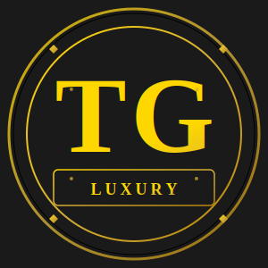

# TG Luxury Logo Options

Three professional logos have been created for Takudzwa Gift Luxury Boutique. Choose the one that best matches your brand vision!

## 📎 Logo Files

### 1. **logo-tg-luxury.svg** - Classic Luxury Design
- **Style:** Traditional luxury with gold and black
- **Best For:** Professional, elegant, upscale feel
- **Features:**
  - Gold gradient background
  - Black lettering
  - Decorative border accents
  - Luxury tagline
- **Use When:** You want a timeless, sophisticated look

### 2. **logo-tg-elegant.svg** - Premium Elegant Design
- **Style:** Modern luxury with decorative elements
- **Best For:** High-end boutique branding
- **Features:**
  - Sophisticated geometry
  - Multiple gradient layers
  - Decorative circles and lines
  - Premium aesthetic
- **Use When:** You want impression and prestige

### 3. **logo-tg-modern.svg** - Contemporary Minimalist
- **Style:** Clean, modern, geometric
- **Best For:** Digital and web presence
- **Features:**
  - Geometric shapes
  - Minimalist design
  - Modern feel
  - Simple yet elegant
- **Use When:** You prefer clean, contemporary branding

## 🎨 Color Palette

All logos use:
- **Primary Gold:** #d4af37 and #ffd700
- **Black:** #000 and #1a1a1a
- **Accent:** #b8860b

## 🌐 How to Use Your Logo

### In Your Website

#### Option 1: Replace the TG Text in Navigation
Update `index.html`:
```html
<div class="nav-logo">
    <a href="#home" class="tg-logo">
        
    </a>
</div>
```

#### Option 2: Add as Favicon
```html
<link rel="icon" type="image/svg+xml" href="logo-tg-modern.svg">
```

#### Option 3: Display in Hero Section
```html
<section class="hero">
    
    <h1>CRAFTED FOR DISTINCTION</h1>
</section>
```

## 🎯 Recommended Usage

| Location | Recommended Logo |
|----------|------------------|
| Navigation Bar | logo-tg-luxury.svg |
| Hero Section | logo-tg-elegant.svg |
| Favicon | logo-tg-modern.svg |
| Business Cards | logo-tg-elegant.svg |
| Social Media | logo-tg-modern.svg |
| Email Footer | logo-tg-luxury.svg |
| Print Material | logo-tg-elegant.svg |

## 📏 SVG Advantages

- **Scalable:** Perfect quality at any size
- **Lightweight:** Small file sizes
- **Flexible:** Can be resized without losing quality
- **Editable:** Can modify colors in code if needed

## 🔄 Customizing Your Logo

### Change Colors
Edit the SVG file and modify:
```xml
<!-- Gold color -->
#d4af37  →  Your preferred gold

<!-- Black color -->
#1a1a1a  →  Your preferred dark color
```

### Change Text
Modify the font-family or font-weight in the SVG:
```xml
<text font-family="'Times New Roman', Georgia, serif">TG</text>
```

## 💾 Export Options

### For Web Use
- Keep as SVG (best quality and size)
- Use directly in HTML/CSS

### For Print
1. Open SVG in graphic editor (Illustrator, Inkscape)
2. Export as PNG (300 DPI for printing)
3. Or convert to PDF for vector quality

### For Social Media
1. Open logo-tg-modern.svg in editor
2. Export as PNG (1200x1200px for Instagram/Facebook)
3. Add transparent background

## 🎨 Logo Modification Tips

### If You Want Custom Modifications:
1. **Online SVG Editor:** Use https://boxy-svg.com or https://vectr.com
2. **Desktop Software:**
   - Inkscape (free)
   - Adobe Illustrator
   - CorelDRAW

3. **Professional Designer:** Hire on Fiverr or Upwork for custom variations

## ✅ Final Recommendation

For a luxury boutique like Takudzwa Gift:
- **Primary:** Use `logo-tg-elegant.svg` - Most prestigious and upscale
- **Secondary:** Use `logo-tg-luxury.svg` - Classic and timeless
- **Digital:** Use `logo-tg-modern.svg` - Clean and contemporary

## 📝 Logo Usage Guidelines

1. **Minimum Size:** Never display smaller than 50x50px on web
2. **Spacing:** Keep 10px clear space around logo
3. **Backgrounds:** Use on white or dark backgrounds (not competing gradients)
4. **Consistency:** Use same logo throughout all platforms
5. **Scaling:** Maintain aspect ratio when resizing

## 🎉 You're All Set!

Your TG Luxury Boutique has three professional logos ready to use. Each brings a different personality to your brand!

**Questions?** The logos are SVG files - you can open them in any text editor to make quick color changes!
